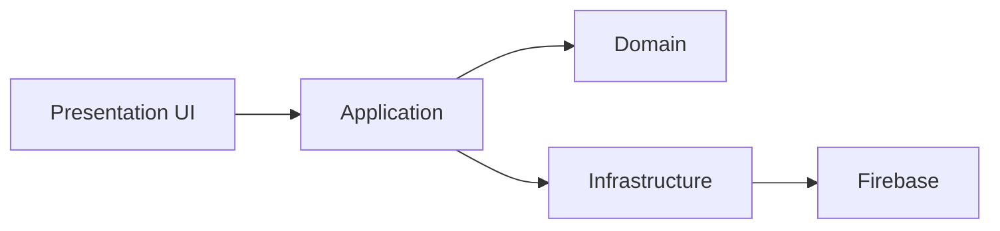
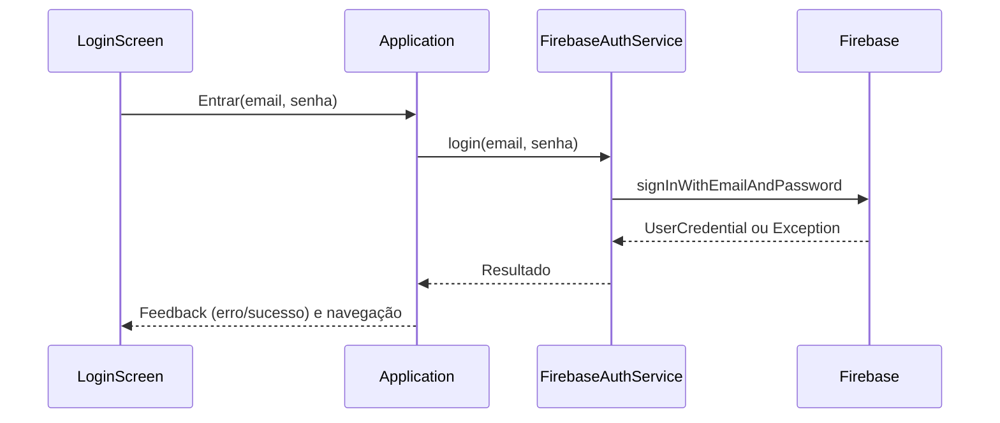
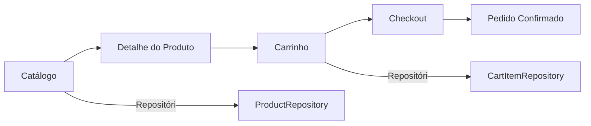
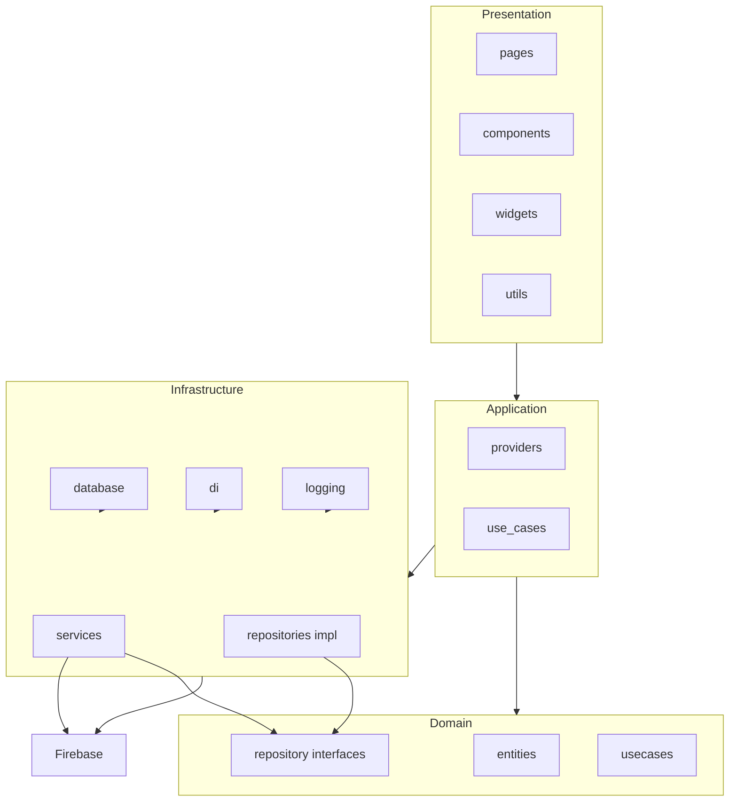

# FeiraGreen Flutter

Aplicativo Flutter voltado para e-commerce de produtos (carrinho, catálogo, login/registro e fluxo de compra), estruturado em camadas claras e com testes de unidade, de tela e de integração.

## Visão Geral
- Projeto multiplataforma (Android, iOS, Web, Windows, Linux, macOS) utilizando Flutter.
- Integração com Firebase (arquivos `google-services.json` e `firebase_options.dart` presentes).
- Arquitetura organizada por camadas: `domain`, `infrastructure`, `application`, `presentation`.
- Testes cobrindo fluxo de autenticação, telas de login/registro e fluxo de compra.

## Principais Funcionalidades
- Autenticação de usuário (login, registro, logout).
- Catálogo de produtos e carrinho de compras.
- Fluxo de compra com testes de integração.
- Camada de repositórios para produtos, carrinho e usuários.

## Arquitetura
O projeto segue uma separação por responsabilidades:
- `lib/domain`: entidades e contratos (interfaces) da regra de negócio.
- `lib/infrastructure`: implementações concretas (serviços, repositórios, integração com dados/Firebase, logging, DI).
- `lib/application`: orquestradores, providers e casos de uso expostos à UI.
- `lib/presentation`: componentes visuais (páginas, widgets, utils) e camada de interação com o usuário.
- `lib/repositories`: repositórios específicos utilizados pela aplicação (ex.: `product_repository.dart`, `cart_item_repository.dart`, `user_repository.dart`).

Essa divisão facilita testes, manutenção e evolução das funcionalidades.

## Estrutura de Pastas (resumo)
- `assets/`: imagens e recursos estáticos.
- `integration_test/`: testes de integração (ex.: `purchase_flow_test.dart`).
- `test/`: testes de unidade e de tela
  - `unit/`: testes de serviços e utilitários (ex.: `firebase_auth_service_test.dart`, `database_helper_test.dart`).
  - `screens/`: testes de UI (ex.: `login_screen_test.dart`, `register_screen_test.dart`).
  - `services/`: testes ligados a serviços (ex.: `auth_service_test.dart`).
  - `integration/`: fluxo de autenticação end-to-end (ex.: `auth_flow_test.dart`).
- `test_driver/`: driver para testes de integração (`integration_test.dart`).
- `android/`, `ios/`, `macos/`, `linux/`, `windows/`: projetos/plataformas nativas.
- `web/`: recursos para execução no navegador.

## Dependências Principais
- Flutter SDK e Dart.
- Firebase (configurado via `firebase_options.dart` e `google-services.json`).
- Ferramentas de teste do Flutter (`flutter_test` e `integration_test`).

## Pré-requisitos
- Instalar o Flutter (recomendado canal estável) e Dart.
- Configurar as plataformas desejadas (Android/iOS SDKs, ferramentas de build de desktop).
- Ter o Firebase configurado no projeto (ver seção abaixo).

## Instalação e Execução
- Instalar dependências:
  - `flutter pub get`
- Executar o app:
  - `flutter run`
  - Para plataforma específica: `flutter run -d windows` (ou `android`, `chrome`, etc.)

## Configuração do Firebase
- Arquivos presentes:
  - Android: `android/app/google-services.json` (e um `android/google-services.json` no topo do projeto).
  - iOS/macOS: configuração via `Runner` e `firebase_options.dart`.
  - Dart: `lib/firebase_options.dart` (gerado pelo FlutterFire CLI).
- Caso altere o projeto no Firebase, regenere `firebase_options.dart` com FlutterFire CLI:
  - `dart pub global activate flutterfire_cli`
  - `flutterfire configure`

## Testes
- Executar todos os testes:
  - `flutter test`
- Executar uma suíte específica com reporter expandido:
  - `flutter test test/unit/firebase_auth_service_test.dart -r expanded`
- Observações:
  - Alguns testes de tela ajustam `MediaQuery`/janela de teste para evitar overflow em componentes largos.
  - Os testes de integração usam `integration_test/` e `test_driver/integration_test.dart`.

## Convenções de Código
- Lint configurado em `analysis_options.yaml` (consistência de estilo e boas práticas).
- Formatação:
  - `dart format .`
- Análise estática:
  - `flutter analyze`

## Build e Distribuição
- Android:
  - Certifique-se de que `google-services.json` está em `android/app/`.
  - `flutter build apk` ou `flutter build appbundle`.
- iOS:
  - Abra o projeto com Xcode para configurar assinaturas e capabilities.
  - `flutter build ios` (em macOS).
- Web:
  - `flutter build web` (gera artefatos em `build/web`).
- Desktop (Windows, Linux, macOS):
  - `flutter build windows` / `flutter build linux` / `flutter build macos`.

## Dicas de Desenvolvimento
- Mantenha lógica de negócio em `domain` e implementações em `infrastructure`.
- Use `application/providers.dart` para expor dependências à UI.
- Reutilize componentes em `presentation/components` e `presentation/widgets`.
- Imagens e ícones em `assets/` devem ser referenciados no `pubspec.yaml`.

## Problemas Conhecidos
- Em alguns ambientes de teste, textos extensos podem causar overflow em `Row`/`Flex`. Os testes ajustam `textScaleFactor`/tamanho de janela para evitar falhas de layout.
- Integrações de autenticação mockadas podem não reproduzir todos os cenários de erro reais do Firebase; alinhe expectativas dos testes ao comportamento dos mocks.

## Contribuição
- Fluxo sugerido:
  - Crie uma branch a partir de `main`.
  - Realize mudanças pequenas e atômicas.
  - Garanta que `flutter analyze` e `flutter test` passam.
  - Abra um Pull Request descrevendo a mudança.

## Exemplos de Código

### Validação de email na LoginScreen (exemplo simplificado)
```dart
bool isEmailValid(String value) => value.contains('@');

// Dentro do formulário
TextFormField(
  // ideal ter uma key para facilitar o teste: Key('emailField')
  validator: (value) {
    if (value == null || value.isEmpty) return 'Informe o email';
    if (!isEmailValid(value)) return 'Email inválido';
    return null;
  },
)
```

### Teste de UI: erro para email inválido
```dart
import 'package:flutter_test/flutter_test.dart';
import 'package:flutter/material.dart';
import 'package:feiragreen_flutter/presentation/pages/login_screen.dart';

Widget buildTestApp(Widget child) {
  return MediaQuery(
    data: const MediaQueryData(textScaleFactor: 0.7),
    child: MaterialApp(home: child),
  );
}

void main() {
  testWidgets('Email inválido mostra erro', (tester) async {
    await tester.pumpWidget(buildTestApp(const LoginScreen()));

    // Preenche email sem '@' e senha
    await tester.enterText(find.byType(TextFormField).at(0), 'invalido');
    await tester.enterText(find.byType(TextFormField).at(1), '123456');

    // Toca no botão Entrar
    await tester.tap(find.text('Entrar'));
    await tester.pumpAndSettle();

    // Verifica mensagem de erro
    expect(find.text('Email inválido'), findsOneWidget);
  });
}
```

### Teste de Unidade: login com MockFirebaseAuth
```dart
import 'package:flutter_test/flutter_test.dart';
import 'package:firebase_auth_mocks/firebase_auth_mocks.dart';
import 'package:feiragreen_flutter/infrastructure/services/firebase_auth_service.dart';

void main() {
  test('Login sucesso retorna UserCredential', () async {
    final mockAuth = MockFirebaseAuth(signedIn: true);
    final service = FirebaseAuthService(mockAuth);

    final result = await service.login('user@example.com', 'password');
    expect(result.user, isNotNull);
  });

  test('Login falha lança Exception (mock genérico)', () async {
    final mockAuth = MockFirebaseAuth(signedIn: false);
    final service = FirebaseAuthService(mockAuth);

    expect(
      () async => service.login('naoexiste@example.com', 'errada'),
      throwsA(isA<Exception>()), // ou alinhar para FirebaseAuthException se o serviço propagar
    );
  });
}
```

### Repositório de Produtos (uso hipotético)
```dart
import 'package:feiragreen_flutter/repositories/product_repository.dart';

final repo = ProductRepository();
final products = await repo.getAll();
// Atualiza estado da UI com a lista de produtos
```

### Helper para evitar overflow em testes de UI
```dart
Widget buildTightLayoutTestApp(Widget child) {
  return MediaQuery(
    data: const MediaQueryData(textScaleFactor: 0.7),
    child: MaterialApp(home: child),
  );
}
```

## Diagramas (simplificados)

### Arquitetura por camadas


### Fluxo de autenticação


### Fluxo de compra (alto nível)


## Diagrama de Pacotes


